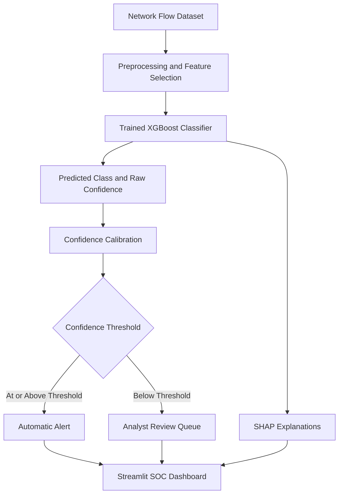

Confidence-Aware Explainable Network Intrusion Detection System (NIDS)

**An AI-powered cybersecurity system that detects network intrusions, estimates prediction confidence, explains model decisions, and routes uncertain predictions for human review.**

[](https://www.python.org/)
[](https://xgboost.readthedocs.io/)
[](https://streamlit.io/)
[](https://shap.readthedocs.io/)

Overview

Modern networks face a wide range of cyber threats, including denial-of-service attacks, brute-force attempts, scanning, and other malicious traffic. Machine learning can help identify these threats, but a high-confidence prediction is not necessarily a correct prediction.

The **Confidence-Aware Explainable NIDS** addresses this challenge by combining multiclass intrusion detection, confidence calibration, explainable AI, and human-in-the-loop decision-making in an interactive Security Operations Center (SOC) dashboard.

Instead of treating every prediction equally, the system uses a configurable confidence threshold to decide whether a prediction should be processed automatically or sent to a security analyst for further review.

## Key Features

- **Multiclass intrusion detection:** Classifies network traffic into attack categories using machine learning.
- **Model comparison:** Evaluates Random Forest, XGBoost, and LightGBM to compare predictive performance.
- **Confidence calibration:** Applies a calibration model to improve the reliability of the confidence scores.
- **Confidence-aware alert routing:** Separates high-confidence predictions from predictions requiring analyst review.
- **Explainable AI:** Uses SHAP-based visualizations to help analysts understand which features influence model predictions.
- **Interactive SOC dashboard:** Provides an overview of detection performance, alert triage, error analysis, model metrics, and feature importance.
- **Analyst review queue:** Helps prioritize predictions requiring additional attention.
- **Batch scoring:** Supports uploading network-flow data for prediction through the dashboard.
- **Threshold analysis:** Examines the trade-off between automatic processing, accuracy, and analyst workload.

## What Makes This Project Different?

Traditional intrusion detection models focus primarily on classifying traffic. This project adds a decision layer that considers how much confidence the system has in each prediction.

The workflow is:

1. Extract network-flow features from the input data.
2. Predict the traffic class using the trained XGBoost model.
3. Estimate calibrated confidence for the prediction.
4. Compare confidence against the configured threshold.
5. Route the prediction to automatic alerting or analyst review.
6. Use explainability and error-analysis tools to support investigation.

**Core idea:** Automate high-confidence decisions while directing uncertain predictions to human analysts.

This confidence-aware workflow is intended to help balance detection performance, automation, and the need for human oversight.

## System Architecture



The current implementation works with prepared network-flow data and supports batch scoring through the dashboard. It is a research prototype, not a deployed live packet-capture or production SOC monitoring system.

## Model Performance

The project evaluates multiple machine learning models and selects XGBoost based on the reported experimental results.

### Model comparison

| Model | Accuracy | Weighted F1-score |
|---|---:|---:|
| Random Forest | 98.56% | 98.16% |
| **XGBoost** | **98.73%** | **98.30%** |
| LightGBM | 73.28% | 72.30% |

*These are results from the reported model-comparison experiment. Final dashboard metrics may differ slightly because of differences in evaluation splits or model versions.*

### Confidence-aware routing results

At the selected operating threshold of **0.99**, the reported evaluation produced the following results:

| Metric | Result |
|---|---:|
| Overall model accuracy | 98.75% |
| Automatic alert coverage | 72.15% |
| Automatic alert accuracy | 99.84% |
| Predictions sent for analyst review | 27.86% |
| Incorrect predictions routed for analyst review | 90.98% |
| Incorrect automatic alerts | 45 |

### Understanding these results

- **Automatic alert coverage (72.15%):** Approximately 72% of evaluated predictions met the threshold for automatic processing.
- **Automatic alert accuracy (99.84%):** Approximately 99.84% of predictions processed automatically were correct.
- **Incorrect predictions routed for review (90.98%):** Approximately 91% of all incorrect predictions were directed to the analyst-review path instead of being automatically processed.

These are evaluation results, not guarantees of real-world performance. Confidence-based routing reduces the number of errors automatically processed, but it does not eliminate incorrect predictions.

## Confidence Calibration

Machine learning classifiers can produce confidence scores that do not accurately reflect their actual likelihood of being correct.

This project uses a separate calibration stage to improve confidence reliability. The calibration model is trained using a calibration split and learns the relationship between raw model confidence and prediction correctness.

Reported Expected Calibration Error (ECE):

| Metric | ECE |
|---|---:|
| Raw confidence | 0.00416 |
| Calibrated confidence | 0.00120 |

Lower ECE indicates better agreement between confidence estimates and observed correctness under the evaluation procedure.

The system also evaluates different confidence thresholds to understand how changing the threshold affects automatic coverage, automatic accuracy, and the number of predictions sent for review.

## Explainable AI with SHAP

A detection system should help analysts understand not only what the model predicted, but also which input features influenced its decision.

The project integrates SHAP-based analysis to support model interpretation through:

- Global feature-importance analysis.
- SHAP summary visualizations.
- Feature-contribution analysis for investigating model behaviour.
- Error analysis to identify misclassified traffic and potentially overconfident mistakes.

These explanations help with investigation and model analysis; they should not be treated as proof that a prediction is correct or that a particular feature causes an attack.

## SOC Dashboard

The Streamlit dashboard provides an interactive interface for examining model predictions and operational trade-offs.

| Dashboard section | Purpose |
|---|---|
| **Overview** | Review detection metrics, confidence distributions, calibration, and traffic composition. |
| **Triage & Threshold** | Explore confidence thresholds and their impact on automation and analyst workload. |
| **Analyst Queue** | Inspect predictions requiring review and export selected results. |
| **Error Analysis** | Examine misclassifications, missed attacks, false alarms, and per-class performance. |
| **Models & Features** | Compare model performance and explore feature importance and SHAP visualizations. |
| **Live Scoring** | Upload a supported network-flow CSV or Parquet file and score its records using the trained model. |

*Live Scoring refers to interactive scoring of uploaded data, not continuous live network monitoring.*

## Technology Stack

- **Programming language:** Python
- **Data processing:** Pandas, NumPy
- **Machine learning:** Scikit-learn, XGBoost, Random Forest, LightGBM
- **Explainable AI:** SHAP
- **Visualization:** Plotly, Matplotlib
- **Dashboard:** Streamlit
- **Model persistence:** Joblib
- **Dataset:** CIC-IDS-style network intrusion detection data

## Project Structure

The following shows the principal files used across the project. Some files are used during model development, while others support the dashboard.

```text
confidence-aware-nids/
├── soc_dashboard.py
├── dataset.py
├── eda.py
├── feature_selection.py
├── train_baseline.py
├── hyperparameter_tuning.py
├── calibrate_confidence.py
├── evaluation.py
├── shap_explainability.py
├── baseline_analysis.py
├── requirements.txt
├── final_xgboost.pkl
├── confidence_calibrator.pkl
├── prediction_confidence.csv
├── calibrated_confidence_results.csv
├── adaptive_threshold_results.csv
├── misclassified_predictions.csv
├── feature_importance.csv
├── model_comparison.csv
├── shap_summary_plot.png
├── shap_feature_importance.png
└── waterfall_plot.png
```

Additional datasets, model artifacts, and analysis files may exist in the development environment. Large raw datasets are not required for the deployed dashboard if the necessary model artifacts and dashboard data are already available.

## Installation and Setup

### 1. Clone the repository

```bash
git clone https://github.com/stoopidnerd/confidence-aware-nids.git
cd confidence-aware-nids
```

### 2. Create a virtual environment

```bash
python -m venv .venv
```

Activate it:

**macOS / Linux**
```bash
source .venv/bin/activate
```

**Windows**
```bash
.venv\Scripts\activate
```

### 3. Install dependencies

```bash
pip install -r requirements.txt
```

Ensure the dependencies used by the dashboard are included in `requirements.txt`, including Streamlit, Pandas, NumPy, Plotly, Joblib, Scikit-learn, XGBoost, PyArrow, and Matplotlib.

### 4. Run the dashboard

```bash
streamlit run soc_dashboard.py
```

Open the local URL printed in your terminal, typically `http://localhost:8501`.

### 5. Verify required artifacts

Before launching the dashboard, confirm that the required model files and any evaluation CSVs or visualization files referenced by the dashboard are present at the expected paths.

For live scoring, the dashboard requires:

- `final_xgboost.pkl`
- `confidence_calibrator.pkl`

The input CSV or Parquet file must also contain the network-flow features expected by the trained model.

## Deployment

The dashboard can be deployed using [Streamlit Community Cloud](https://streamlit.io/cloud).

General deployment steps:

1. Push the dashboard and required artifacts to a GitHub repository.
2. Confirm that `requirements.txt` includes all required dependencies.
3. Create a new app in Streamlit Community Cloud.
4. Select the repository, branch, and `soc_dashboard.py` as the entry point.
5. Deploy the app and verify that all dashboard sections work.

**Important:** Avoid committing large raw datasets or unnecessary model artifacts. Keep the repository within GitHub's file-size limits, and include only the artifacts needed for the deployed features.

## Limitations and Future Improvements

This project is an experimental intrusion detection prototype. Potential next steps include:

- **Real-time integration:** Integrate live traffic capture or streaming network telemetry.
- **Imbalanced-class evaluation:** Improve handling of rare attack classes and report per-class precision, recall, and F1-score alongside overall accuracy.
- **Further calibration validation:** Validate calibration across attack classes, datasets, and changing network conditions.
- **Adaptive policies:** Develop threshold-selection policies that account for analyst capacity and the cost of false negatives and false positives.
- **Model monitoring:** Track data drift, changes in attack patterns, and degradation in model performance.
- **Security hardening:** Add input validation, access controls, logging, and safeguards before any operational deployment.

The current confidence threshold is configurable and should be selected according to the application's risk tolerance and operational requirements.

## Use Cases

The system demonstrates concepts applicable to:

- Security Operations Center (SOC) alert triage.
- Network intrusion detection research.
- Confidence-aware machine learning.
- Explainable cybersecurity systems.
- Human-in-the-loop AI decision support.
- Evaluation of automation versus analyst workload.

## Project Impact

This project explores how machine learning can support cybersecurity workflows beyond raw classification accuracy. By combining calibrated confidence, threshold-based routing, explainability, and an interactive dashboard, it demonstrates a framework for making model predictions easier to inspect and safer to operationalize.

The central principle is simple: **a prediction should not be trusted solely because a model reports high confidence.**

## Author

**GitHub:** [@StoopidNerd](https://github.com/StoopidNerd)

**Project repository:** [Confidence-Aware Explainable NIDS](https://github.com/stoopidnerd/confidence-aware-nids)

---

*Disclaimer: This project is intended for educational, research, and demonstration purposes. Its experimental results do not establish production-grade detection capability or guarantee protection against real-world cyberattacks.*
